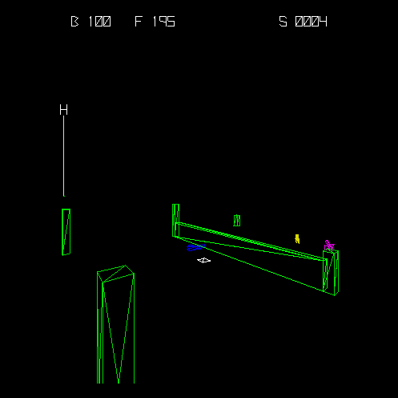

# Vexxon - The Game

Vexxon is a Zaxxon alike game I write for the PiTrex as part of my [Vectrex newsletter](https://vectrex.substack.com)



## PiTrex

### Setup

Before you start build the project files you have to setup at first your PiTrex SD card.
Read this [Newsletter Post](https://vectrex.substack.com/p/newsletter-0-the-pitrex-card) on how this is done.

### Setup assets folder

You must **copy all files** from ```src/game/assets``` to ```{HOME_FOLDER}\Documents\RBProjects```.


### Build

```
$ git clone https://github.com/rogerboesch/playground
$ cd playground
$ cd src/pitrex
$ mkdir build
$ make
```

## Playground App

This project allows to build, execute and test **PiTrex** games on Windows, macOS and Linux.


### Setup

- **CMake** is used as meta build tool
- **SDL2** is used to provide a (graphical) environment on all 3 major platforms


### Setup assets folder

For macOS you don't have to do anything, the asset files are copied into the application bundle.
If you are on Windows or Linux you must **copy all files** from ```src/game/assets``` to ```{HOME_FOLDER}\Documents\RBProjects```.


### Windows

#### Build Playground.exe

To **build** Playground.exe you have to install **SDL2** on your Windows machine.

- Download **SDL2** from https://github.com/libsdl-org/SDL/releases/download/release-2.26.2/SDL2-devel-2.26.2-VC.zip
- Copy the folder *SDL2-2.26.2* to a folder (ex. *C:\Dev*)

```
    C:\> SET SDL2DIR={PATH_TO_FOLDER}
    C:\> git clone https://github.com/rogerboesch/playground.git
    C:\> cd playground\src\playground
```

after that create the Visual Studio (I use 2022) project with

```
    C:\> cmake -B build -G"Visual Studio 17 2022"
```

Now you have a Visual Studio solution file which you can use in the *build* folder.
To execute Playground.exe from within Visual Studio, **SDL2.dll** has to be in the same folder as the executable.


### macOS

#### Build Playground.app

To **build** Playground.app you have to install **SDL2** on your macOS machine.
For this I use homebrew (package manager).

```
    $ brew install sdl2
    $ git clone https://github.com/rogerboesch/playground.git
    $ cd playground/src/playground
```

after that create the XCode project with

```
    $ cmake -B build -GXCode
```

Now you have a XCode solution file which you can use in the *build* folder.


### Linux

#### Build Playground

To **build** Playground you have to install **SDL2** on your Linux machine.

```
    $ sudo apt-get install libsdl2-dev
    $ git clone https://github.com/rogerboesch/playground.git
    $ cd playground\src\playground\
```

after that create the make file with

```
    $ cmake .
```

Now you have a make file which you can use in the *build* folder. To build it you simply type in

```
    $ make
```
